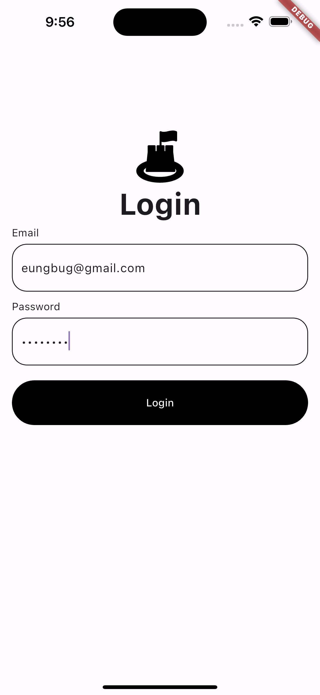
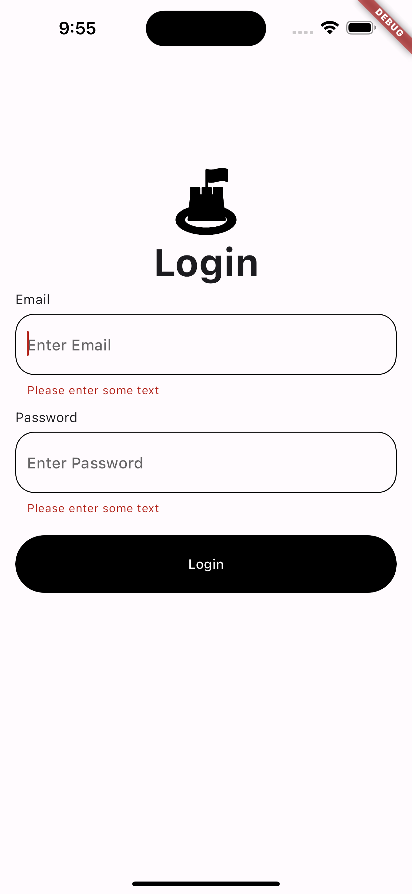

# Login App

| 스크린샷1 | 스크린샷2 |
| :-------: | :-------: |
|  |  |


### 배운 내용

#### Routes

Flutter에서는 `routes`속성을 통해 경로 이름을 통해서 routing 하는 방식으로 경로들을 관리한다.  
`initalRoute`에 설정한 경로에 따라 실행 했을 때 보여질 위젯을 설정할 수 있다.

```dart
@override
Widget build(BuildContext context) {
  return MaterialApp(
    initialRoute: '/login',
    routes: {
      "/login": (context) => const LoginPage(),
      "/hone": (context) => const HomePage(),
    },
  );
}
```

화면 이동 시 `Navigator.pushNamed()`를 통해 다른 라우트로 이동할 수 있다.  
```dart
Navigator.pushNamed(context, "/home");
```


#### ListView

Column이 아닌 ListView로 전체화면을 구성하는 이유 중 하나로는 화면에 TextFormField가 있는 경우 TextFormField를 터치할 경우 아래에서 키보드가 올라오게 되는데, 키보드가 올라오면서 `inset`이라는 화면에 그림을 그릴 수 없는 영역이 생기게 되어 화면을 스크롤 할 수 있도록 ListView로 만들어주면 더 좋다.


#### TextFormField

- obscureText : true인 경우 Input에 마스킹 처리를 하는 속성
- enabledBorder : 기본 Input 디자인
- focusedBorder : focus 상태일 때 디자인
- errorBorder :  error 상태일 때 디자인
- focusedErrorBorder : error 상태에서 focus가 갈 경우 디자인

#### Form Widget

`Form` 위젯은 데이터 전송을 위해 여러 위젯을 함께 그룹화 해주는 컨테이너 위젯이다.  
사용자의 입력을 받아 한번에 감싸서 데이터를 전송해주고, Input 요소들의 유효성을 검사할 수 있다.