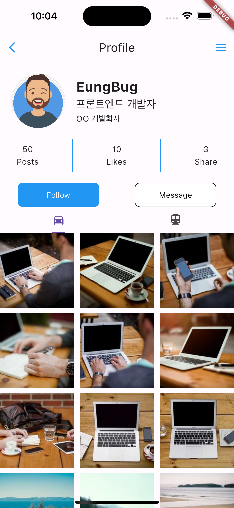
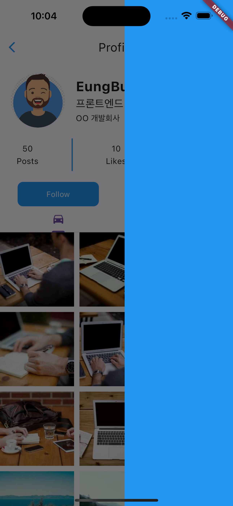

# Profile App

| 스크린샷1 | 스크린샷2 |
| :-------: | :-------: |
|  |  |


### 배운 내용

#### ThemeData

- primaryColor : 브랜드의 아이덴티티를 나타내는 색을 말한다.
- 앱의 상호작용 요소에 사용하는 색상으로 버튼이나 링크, 토글 등 색상들을 Accent Color로 지정한다.

#### 위젯 확장

width나 height의 값으로 `double.infinity`를 주면 위젯이 차지할 수 있는 최대 범위로 확장시킬 수 있다.

#### Drawer

Drawer는 보통 앱에서 화면 위로 슬라이드 되어 표시되는 `드로어 네비게이션`을 구현할 때 사용하는 위젯이다.  
Scaffold의 속성을 통해 왼쪽이나 오른쪽 가장자리에서 수평으로 슬라이드 하는 위젯을 추가할 수 있다.  
왼쪽에서 오른쪽으로 슬라이드 하는 경우 `drawer` 속성을 이용하고, 오른쪽에서 왼쪽으로 슬라이드 하는 경우 `endDrawer` 속성을 이용한다.

AppBar의 구성
- leading : 왼쪽 상단에 위젯을 추가할 수 있는 속성
- title : AppBar의 제목을 추가할 수 있는 속성
- action : 오른쪽 상단에 위젯을 추가할 수 있는 속성

#### InkWell

InkWell 위젯은 모든 위젯을 `버튼화` 시켜주는 위젯으로 보통 Container 위젯을 통해 버튼을 디자인 한 후 `InkWell로` 감싸 버튼을 만들곤 한다. 이렇게 할 경우 버튼 디자인을 기본 버튼 위젯들 보다 자유롭게 할 수 있다.

``` dart
Widget _buildMessageButton() {
  return InkWell(
    onTap: () {},
    child: Container(
      alignment: Alignment.center,
      width: 150,
      height: 45,
      decoration: BoxDecoration(
        color: Colors.white,
        border: Border.all(),
        borderRadius: BorderRadius.circular(10),
      ),
      child: const Text(
        'Message',
        style: TextStyle(
          color: Colors.black,
        ),
      ),
    ),
  );
}
```

#### Tab

Tab을 만들기 위해서는 `TabBar` 위젯과 `TabBarView` 위젯을 이용하여 만들 수 있다.  

TabBar에는 각가의 탭 역할을 할 `Tab` 위젯들이 필요하며, `tabs` 속성에 Tab 위젯들을 넣어주면 된다.
TabBarView는 현재 선택된 탭에 따라 해당하는 화면을 표시하는 위젯으로 TabBar와 TabBarView 위젯은 `controller` 속성을 통해 필수로 `TabController` 객체를 연결해야 한다.  
이때 TabController를 사용하기 위해서는 `TickerProvider`가 필요하다.