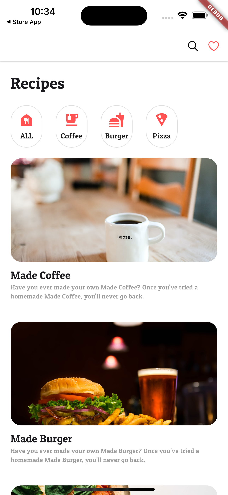
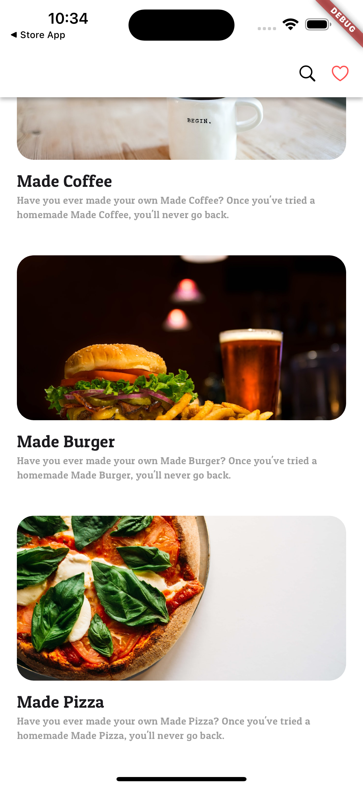

# Recipe App

| 스크린샷1 | 스크린샷2 |
| :-------: | :-------: |
|  |  |


### 배운 내용

#### Image Widget Fit

- BoxFit.contain : 원본 사진의 가로 세로 비율 변화 없음
- BoxFit.fill : 원본 사진의 비율을 무시하고 영역에 사진 크기를 맞춤
- BoxFit.cover: 원본 사진의 가로 세로 비율을 유지한 채 영역에 사진을 맞추지만 영역을 벗어나면 잘릴 수 있음

#### AspectRatio Widget

AspectRatio 위젯은 특정 종횡비로 자식의 크기를 변경하는 위젯이다.  
이미지의 비율을 정하여 표시할 때 주로 사용한다.

```dart
AspectRatio( 
	aspectRatio: 2 / 1, 
	child: 
		Image.asset(
			 "assets/images/$imageName.jpeg", 
			 fit: BoxFit.cover, 
		), 
),
```

#### ClipRRect Widget

ClipRRect 위젯은 둥근 사각형을 사용하여 자식 위젯을 자르는 위젯이다.  
위젯에 shape이나 decoration 속성이 없는 경우 ClipRRect를 이용해 BorderRadius를 줄 수 있다.  

